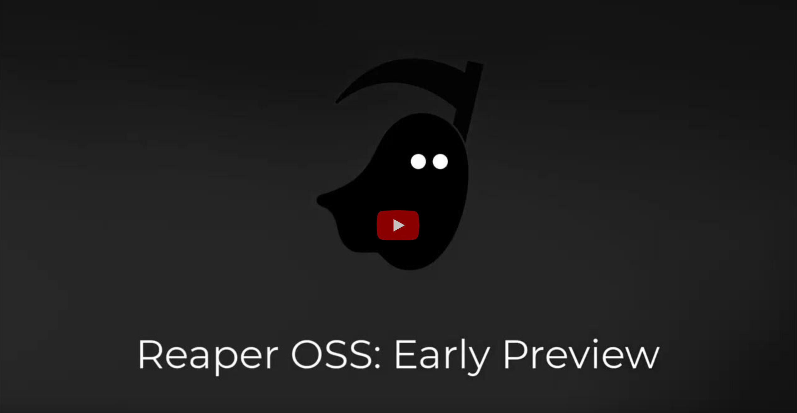

# Reaper

> :warning:
> This project is experimental and will likely change significantly in the future.

Reaper is a reconnaissance and attack proxy, built to be a modern, lightweight, and efficient equivalent to Burp
Suite/ZAP etc. This is an attack proxy with a heavy focus on automation, collaboration, and building universally
distributable workflows.

## Documentation

For further documentation on installation, configuration and usage, check out
the [docs](https://ghostsecurity.github.io/reaper).

