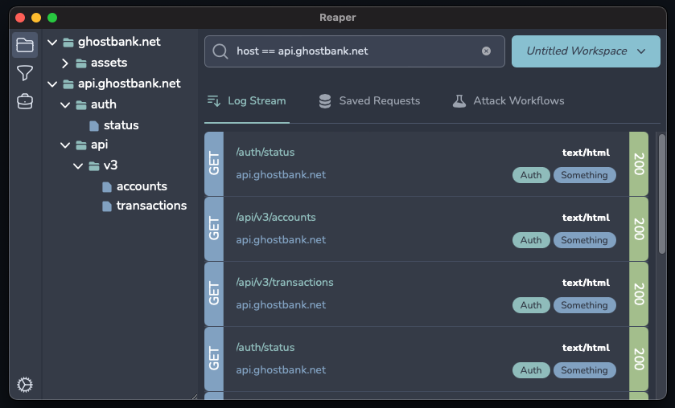

# Reaper

> :warning:
> This is a work in progress. It's an experimental PoC and will likely change almost entirely over time.

Reaper is a reconnaissance and attack proxy, built to be a modern, lightweight, and efficient equivalent to Burp
Suite/ZAP etc. This is an attack proxy with a heavy focus on automation, collaboration, and building universally
distributable workflows.

## Installation

You can grab a binary from the [latest release](https://github.com/ghostsecurity/reaper/releases/latest), `chmod +x` it,
and run it. Make sure you download the right binary for your OS and architecture.

For a more permanent install, copy it into your `PATH`, e.g. `/usr/bin/reaper`.

You will be able to install with your favourite package manager in time.

If your architecture does not have a prebuilt binary in the latest release, you can build it yourself. See below.

## Documentation

For further documentation on configuration and usage, check out the [wiki](wiki).

## Building and Hacking Locally

The following steps should work across Mac, Linux and Windows:

1. Clone the repo.
2. Ensure you have Go (1.19+) and npm installed.
3. Run `make wails` to install Wails v2.
4. Run `wails doctor` to ensure your environment is configured correctly. Install any missing dependencies as prompted.
5. Run `make run` to start _reaper_.
