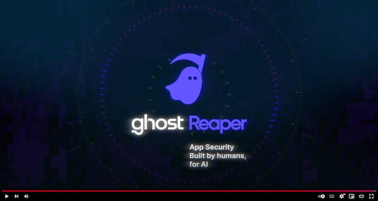

<h1> Reaper</h1>

Reaper by [Ghost Security](https://ghost.security) is a modern, lightweight, and deadly effective open-source application security testing framework—engineered by humans and primed for AI. Reaper slashes through the complexities of app security testing, bringing together reconnaissance, request proxying, request tampering/replay, active testing, vulnerability validation, live collaboration, and reporting into a *killer* workflow. When paired with an AI Agent, Reaper reaps even greater rewards, transforming into a powerful engine that slays application vulnerabilities with precision and efficiency.

<!-- LOGO AND YOUTUBE -->
 

  <i>Watch the demo video!</i> 
  
    

> :warning:
> This project is undergoing rapid development and may change significantly in the near future.

## 💿 Getting Started

Follow [the installation and getting started guide](docs/getting_started.md) for getting Reaper up and running on your machine.

## 👻 About

Reaper was created to give appsec analysts, pentesters, and bug bounty hunters a single, razor-sharp tool that brings together every phase of application security testing into one efficient workflow. It slashes through the manual, time-intensive steps required to uncover application vulnerabilities, exorcising the lingering demons of application security.

While existing tools like Burp Suite, Zap, Subfinder, and Katana tackle individual stages of the testing lifecycle well, Reaper wields a scythe where others use scissors, stitching the entire process back together with cutting-edge technology.

Built for orchestration by both humans and AI, Reaper transforms appsec testing into a streamlined, high-speed process. LLM-powered AI Agents step in as tireless team members, mowing through tedious tasks that would take hours for a human analyst in mere seconds. Picture having a teammate who never sleeps, understands the depths of application security, and works at lightning speed assisting with test parameter tuning, data analysis, findings summaries, and reporting 🤤.

(<a href="#readme-top">back to top</a>)

## 🎯 Project Goals

- A modern, lightweight, and extensible framework for application security testing
- Usable by humans and AI Agents alike
- A platform for running autonomous workflows
- Easy to maintain and extend
- Reduce security engineer burnout with helpful automation

(<a href="#readme-top">back to top</a>)

<!-- CONTRIBUTING -->
## 💜 Contributing

First, thank you for taking the time to check out Reaper! Our primary goals are to get as many folks using it as possible and to drive a roadmap based on user feedback.  If you have a great idea for an enhancement or you have encountered a bug, we'd greatly appreciate a well-formed [Issue](https://github.com/ghostsecurity/reaper/issues/new) in this repo so we can triage and prioritize accordingly.

Reaper is distributed under the [Apache 2.0 License](LICENSE). All Reaper contributors and community members must adhere to the [Code of Conduct](CODE_OF_CONDUCT.md)

(<a href="#readme-top">back to top</a>)

<!-- ACKNOWLEDGMENTS -->
## 👏 Acknowledgments

We want to tip our hats to our friends at [ProjectDiscovery](https://github.com/projectdiscovery), who produce a suite of open source tools tailored for offensive security practitioners, security engineers, bug bounty hunters, and red teamers. ProjectDiscovery is the creator of [subfinder](https://github.com/projectdiscovery/subfinder), [katana](https://github.com/projectdiscovery/katana), [nuclei](https://github.com/projectdiscovery/nuclei), and many other great tools.

(<a href="#readme-top">back to top</a>)

