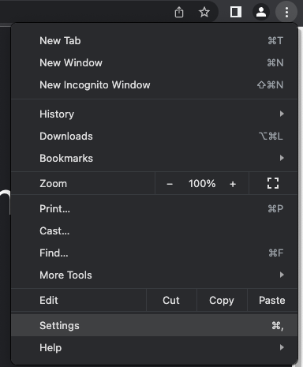
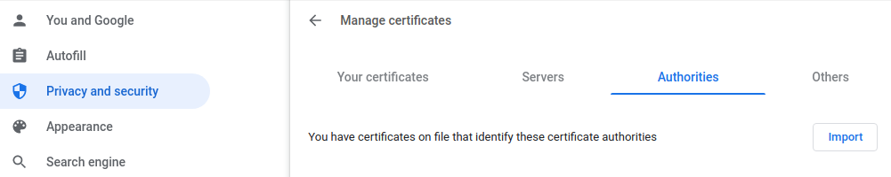
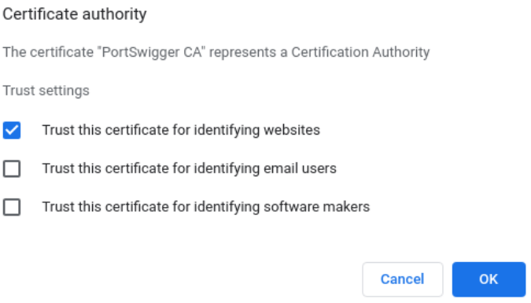

## Chrome (Linux) Setup

### Install the Reaper CA Certificate

1. First, ensure you have [installed](../installation) Reaper.
2. Launch Reaper and select or create a new workspace.
3. Hit the cog icon in the bottom left.

   
4. Select `Certificates` and hit the `Export CA Certificate` button. Export the certificate somewhere convenient,
   perhaps your home directory or desktop - it only needs to be there temporarily.

   
5. Launch Chrome and open the Settings menu.

   
6. Navigate to `Privacy and security` and select `Manage certificates`.

   
7. Select the `Authorities` tab and hit `Import`.
8. Import the certificate you exported from Reaper earlier.
9. Check `Trust this certificate for identifying websites` and click OK.

   
10. Restart Chrome.

### Configure Chrome to use Reaper

It is recommended to use a Chrome extension to manage your proxy use, such
as [Proxy Switcher](https://chrome.google.com/webstore/detail/proxy-switcher/iejkjpdckomcjdhmkemlfdapjodcpgih). Tools
like this allow you to quickly
switch between proxies and configure particular proxies for particular URLs. This means you can configure Chrome to
only use Reaper for a target web application, and route all other traffic as usual. You can use the proxy
address `127.0.0.1:8081` to send traffic through Reaper.

Alternatively, you can configure Chrome to use Reaper directly (not recommended).

Finally, you should [test](test) your setup.
