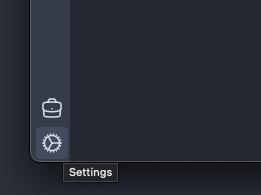
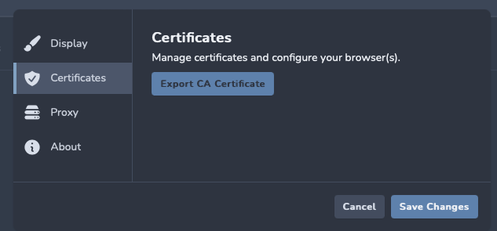
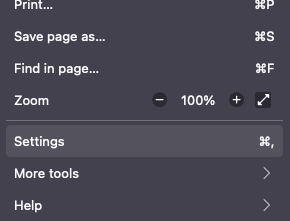
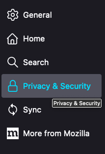
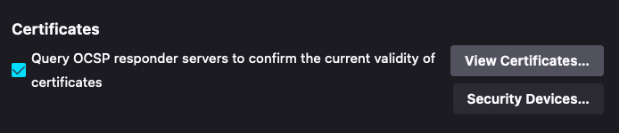
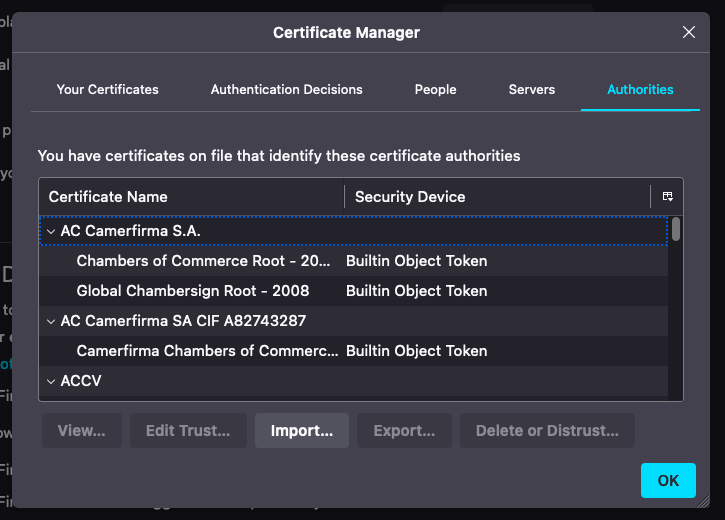

## Firefox Setup

### Install the Reaper CA Certificate

1. First, ensure you have [installed](../installation) Reaper.
2. Launch Reaper and select or create a new workspace.
3. Hit the cog icon in the bottom left.

   
4. Select `Certificates` and hit the `Export CA Certificate` button. Export the certificate somewhere convenient,
   perhaps your home directory or desktop - it only needs to be there temporarily.

   
5. Next, launch Firefox and open the Settings menu (`⌘,` on Mac).

   
6. Navigate to `Privacy & Security` and scroll down to `Certificates`.

   a
7. Hit `View Certificates` and select the `Authorities` tab.

   
8. Hit `Import` and select the certificate you exported from Reaper.

   
9. Ensure `Trust this CA to identify websites` is checked and hit `OK`.

### Configure Firefox to use Reaper

It is recommended to use a Firefox extension to manage your proxy use, such
as [FoxyProxy](https://addons.mozilla.org/en-US/firefox/addon/foxyproxy-standard/). Tools like this allow you to quickly
switch between proxies and configure particular proxies for particular URLs. This means you can configure Firefox to
only use Reaper for a target web application, and route all other traffic as usual. You can use the proxy
address `127.0.0.1:8081` to send traffic through Reaper.

Alternatively, you can configure Firefox to use Reaper directly (not recommended):

1. Launch Firefox and open the Settings menu (`⌘,` on Mac).
2. Navigate to `General` and scroll down to `Network Settings`.
3. Select `Settings` and select `Manual proxy configuration`.
4. Enter proxy `127.0.0.1` and port `8081` for `HTTP Proxy` and check the `Also use this proxy for HTTPS` box.
5. [Test](test) your setup.