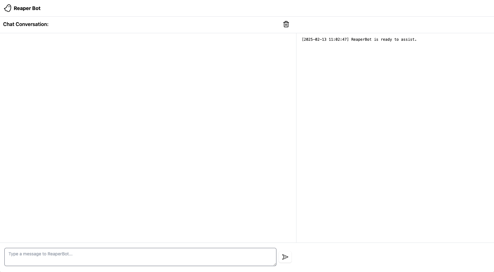

# ReaperBot

ReaperBot is an experimental Agentic AI system designed specifically to orchestrate the Reaper project via its APIs to solve the Ghostbank challenge and showcase the emergent behavior of this type of system applied to the AppSec testing space. It uses multiple specialized agents using the [Pydantic-AI](https://ai.pydantic.dev/) framework powered by [OpenAI](https://openai.com/api/) models for tasks like discovering live hosts, scanning domains, identifying potential security vulnerabilities (e.g., BOLA/IDOR), and reporting on the findings.

## Setup Instructions

1. **Clone the repository**:
    ```bash
    git clone https://github.com/yourusername/reaperbot.git
    cd reaperbot
    ```

2. **Ensure you have Python 3.13+ and uv installed**.
    ```bash
    python3 --version
    uv -V
    ```

3. **Install the dependencies**:
    ```bash
    uv sync
    ```

4. **Obtain API keys**:
    - [OpenAI API Key](https://platform.openai.com/account/api-keys)
    - Reaper Token - Navigate to the Reaper UI and fetch the token by clicking the key icon in the lower left of the navbar.

5. **Set up environment variables**:
    Create a `.env` file based on the `sample.env` and fill in the required keys:
    ```ini
    OPENAI_API_KEY="sk_your_openai_api_key"
    X_REAPER_TOKEN="your_reaper_api_key"
    REAPER_BASE_URL="http://localhost:8000"
    ```

6. **Run the application**:
    Start the FastAPI app with Uvicorn:
    ```bash
    make run
    ```

7. **Access the chat interface**:
    ```
    make ui
    ```
    or browse to `http://localhost:11000`

    

## Usage

Once the application is running, you can interact with ReaperBot through the WebSocket interface. Type in a command or request related to web application security, and ReaperBot will guide you through the steps to scan domains, find live hosts and endpoints, and test for vulnerabilities.

### Example Commands:
- "Scan the (domain_name) domain"
- "What are the live hosts for (domain_name)?"
- "What endpoints in (domain_name) are vulnerable to BOLA?"
- "Which endpoints in the (domain_name) application are vulnerable to BOLA? Write a technical report on the findings."


## License

This project is licensed under the Apache 2.0 License - see the [LICENSE](../LICENSE) file for details.
